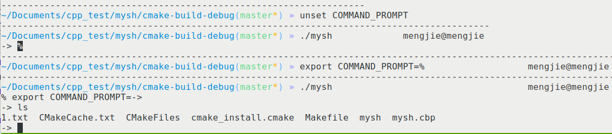
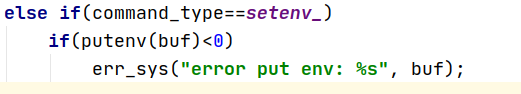
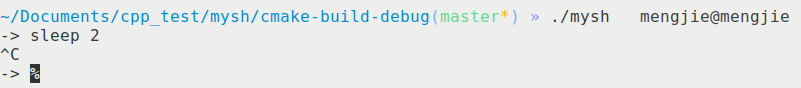
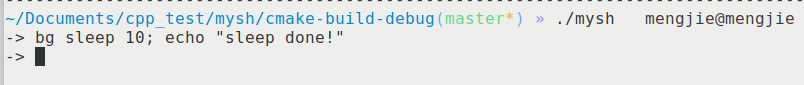
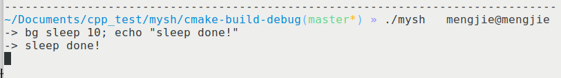
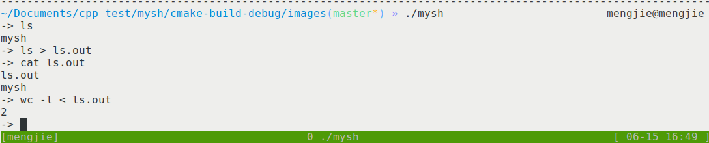

# mysh

## 编译

1. cmake:

   ```shell
   mkdir build
   cd build
   make
   ```

2. make: pass

## 功能实现

1. 环境变量改变命令提示符

    

    通过读取环境变量: COMMAND_PROMPT, 设置命令提示符. 可以在mysh中直接设置环境变量.

    ```c
    setenv("COMMAND_PROMPT", "->", 0);
    char* ret = getenv("COMMAND_PROMPT");
    return ret;
    ```

    实现方法: 当COMMAND_PROMPT为未定义时, 设置其为默认值->, 然后通过getenv获取其值.

    

    mysh中设置环境变量实现方法: 通过字符串处理获取命令类型, 如果是设置环境变量类型的, 则调用putenv函数设置环境变量.

2. 命令关闭程序

    

    通过 Ctrl+C 可以关闭mysh正在运行的程序. 通过 Ctrl+D 可以关闭shell.

3. 后台机制

    

    

    可以实现后台机制, 并且后台输出直接输出到stdout上, 和系统的shell处理方法一致.

    ```c
    else if(command_type==normal&&(pid=waitpid(pid, &status, 0))<0)
        err_sys("wait pid error");
    ```

    实现方法: 通过命令字符串处理识别是否为后台任务, 如果是则父进程不执行waitpid等待子进程.

4. 输出重定向&&输入重定向

    

    由于直接使用system执行命令, 所以不需要额外的代码.
